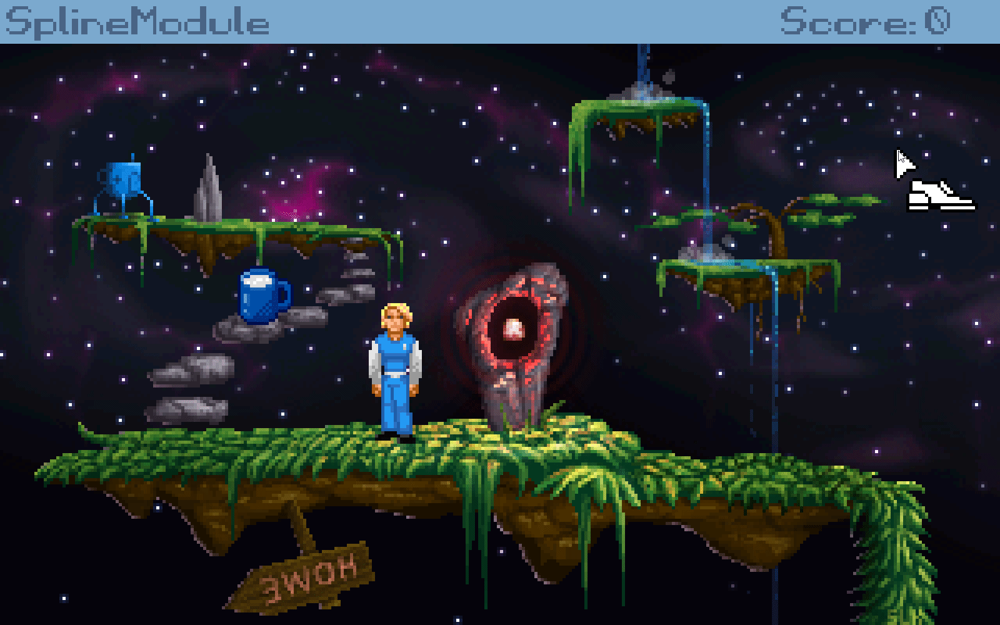

Spline Module
======================

**Spline** is a module for AGS ([Advanture Game Studio](http://www.adventuregamestudio.co.uk/)) engine. 

This module provide two related functins
1. The ability to draw splines.
2. The ability to create a spline path that can be used for aimations.

It can be used for puzzles, complex movement animations, drawing ropes, drawing roller coaster rails etc.

### Example

Drawing a spline: 

Animating object movement: 

 Game used for this demo is <i><a href="https://github.com/adventuregamestudio/ags-templates/blob/master/Templates/Sierra-style.agt">Sierra-style </a></i> template. All rights for the shown art are reserved for the respective artists. 

### Importing the Module

Import an `.scm` file ("_Explore Project_ -> Right Click on _Scripts_ -> _Import Script..._. Get it from the [_Releases_](https://github.com/alkhimey/TBD/releases) section on Github.

### Usage

Create a spline object and initialize it:

    Spline s;
    ...
    s.Init();

Add at least 4 waypoints (trying to use module with less will abort your game - this is intentional):

    todo

### Future Plans
todo
